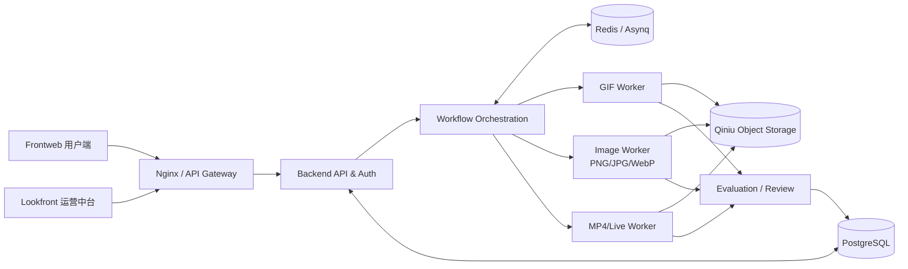
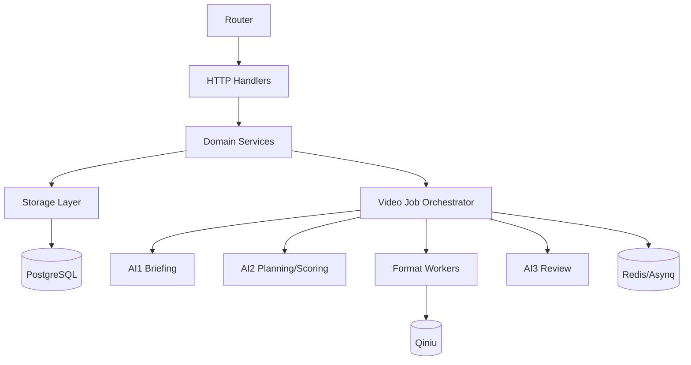

# Yuandu AI Backend

> Industrial AI Visual Asset Production Platform · Backend Control Plane

## 1) 定位（Positioning）

元都AI（Yuandu AI）是工业级 **AI 视觉资产生产平台**。  
本仓库是平台后端中枢，负责 API、任务编排、Worker 调度、质量复审、资产交付与可观测。

- 业务定位：从视频自动生产高价值视觉资产
- 系统定位：高并发调度中枢 + 多格式生产流水线
- 支持格式：GIF / PNG / JPG / WebP / MP4 / Live

---

## 2) 平台架构图（Platform Architecture）



---

## 3) 模块关系图（Backend Modules）



---

## 4) 路线图目录（Roadmap）

| 阶段 | 目标 | 状态 |
|---|---|---|
| Phase 1 | 视频→视觉资产主链路稳定化（多格式、可观测、可回溯） | ✅ In Progress |
| Phase 2 | 引入 GPU 微服务（Real-ESRGAN / SeedVR2）提升重建能力 | 🚧 Planned |
| Phase 3 | 团队化与平台化能力（API/SaaS/协作） | 🗓️ Planned |

---

## 5) Tech Stack

- Go 1.25+
- Gin + GORM
- PostgreSQL
- Redis + Asynq
- ffmpeg / ffprobe
- Qiniu Object Storage

---

## 6) Quick Start

```bash
cp .env.example .env
go run ./cmd/api
# new terminal
go run ./cmd/worker
```

- API default: `:5050`
- Health: `GET /healthz`

---

## 7) Database Migration

```bash
for f in migrations/*.sql; do
  psql "$DATABASE_URL" -v ON_ERROR_STOP=1 -f "$f"
done
```

---

## 8) Deployment

See: [`docs/DEPLOYMENT.md`](./docs/DEPLOYMENT.md)

---

## 9) Open-source Safety

- Do **not** commit real secrets (`.env` is ignored)
- Do **not** commit private model weights / private prompts / private datasets

---

## 10) License

See `LICENSE`.
