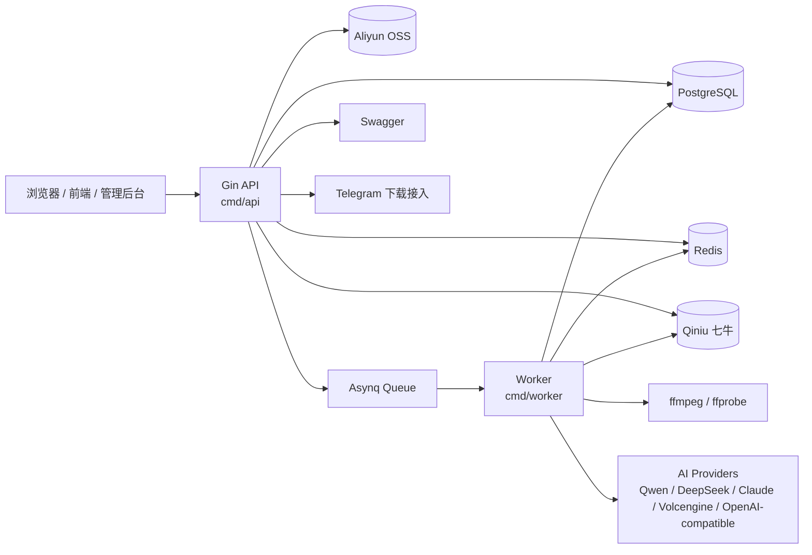
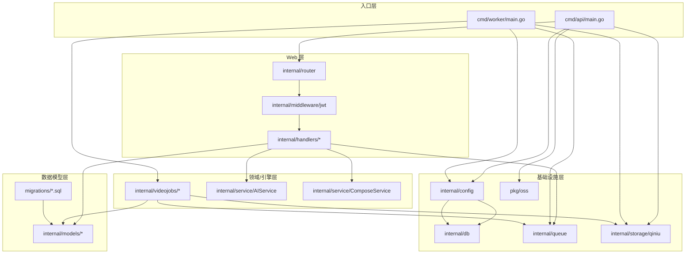
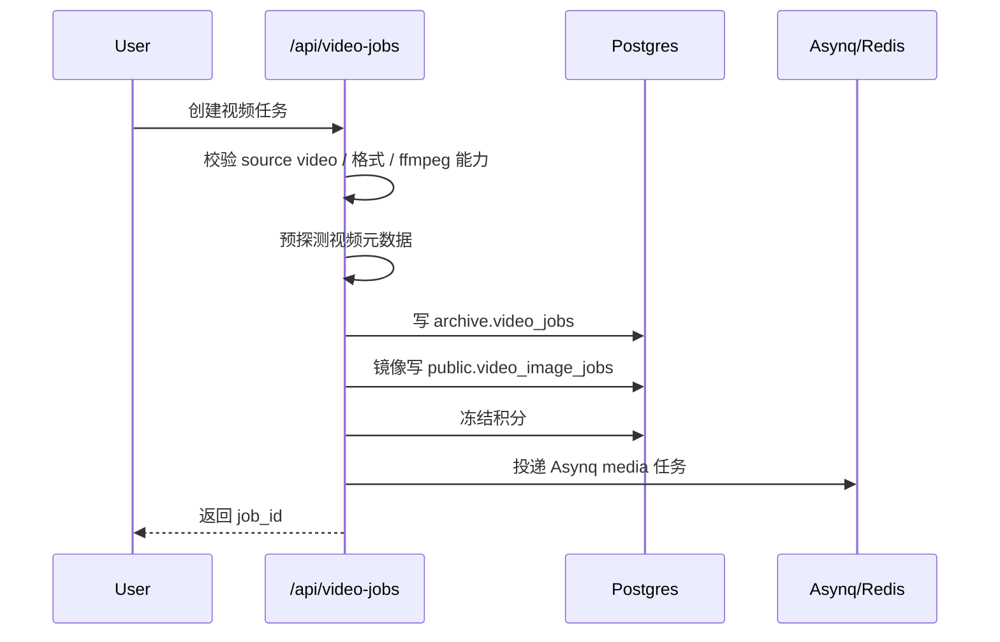
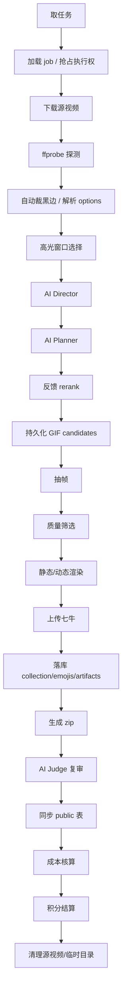

# 01-后端架构图

> 分析日期：2026-03-19  
> 范围：当前工作区代码与未提交改动

## 1. 一句话架构结论

当前后端是一个**以 Gin 单体 API 为入口、Asynq Worker 为异步执行引擎、Postgres 为主数据存储、Redis 为队列与风控缓存、七牛为对象存储、ffmpeg/ffprobe 为媒体运行时、LLM 为 GIF 智能决策增强**的综合业务系统。

它不是微服务拆分架构，而是：

- **同步部分**：API 请求、管理后台、鉴权、内容读写、签名 URL、下载票据
- **异步部分**：视频任务排队、媒体分析、抽帧、渲染、打包、AI 评审、成本与积分结算

---

## 2. 系统上下文图

---

## 3. 运行时架构图

---

## 4. 主业务架构分块

## 4.1 用户与安全

核心文件：

- `internal/handlers/auth.go`
- `internal/handlers/auth_security.go`
- `internal/handlers/sms_limiter.go`
- `internal/handlers/security_risk.go`
- `internal/middleware/jwt.go`

能力：

- 手机验证码登录/注册
- 密码登录
- access / refresh token
- captcha
- Redis 限流
- auth 失败锁定
- 风险事件记录
- 黑名单与自动封禁

---

## 4.2 内容库与表情包管理

核心文件：

- `collections.go`
- `emojis.go`
- `categories.go`
- `tags.go`
- `tag_groups.go`
- `themes.go`
- `downloads.go`
- `import_zip.go`
- `append_zip.go`

能力：

- 合集（Collection）
- 表情（Emoji）
- 分类 / 标签 / 主题 / IP
- 批量上传
- ZIP 导入/追加导入
- 下载列表/下载包
- 收藏/点赞/样本标记

---

## 4.3 存储与下载

核心文件：

- `internal/storage/qiniu.go`
- `internal/handlers/storage.go`
- `internal/handlers/download_tickets.go`

能力：

- 七牛上传 token
- 对象 URL 签名
- 对象代理
- 对象移动/删除/查询
- 下载票据（IP/UA 绑定）
- 私有桶与公有桶兼容

---

## 4.4 视频生产流水线

核心文件：

- `internal/handlers/video_jobs.go`
- `internal/videojobs/processor.go`
- `internal/videojobs/ai_gif_pipeline.go`
- `internal/videojobs/public_sync.go`
- `internal/videojobs/costing.go`
- `internal/videojobs/points.go`

这是整个系统最复杂的核心链路。

### 用户侧创建任务

### Worker 侧执行主流程

### 当前 GIF 子阶段

当前代码已经把 GIF 管线拆成 4 个可观测子阶段：

- `briefing`
- `planning`
- `scoring`
- `reviewing`

这意味着系统已经从“黑盒脚本”进入“可运营流水线”阶段。

---

## 4.5 Public 镜像层

核心文件：

- `internal/models/video_image_public.go`
- `internal/videojobs/public_sync.go`

设计目标：

- 给前台/产品查询更稳定的数据模型
- 将 legacy `archive.video_jobs` 与更产品化的 `public.video_image_*` 解耦
- 让反馈链路围绕 `output_id` 运转，而不完全依赖老的 `collection/emoji` 关系

---

## 4.6 算力账户与成本系统

核心文件：

- `internal/videojobs/points.go`
- `internal/videojobs/costing.go`
- `internal/videojobs/ai_usage.go`
- `internal/handlers/compute_accounts.go`

能力：

- 账户初始化
- 积分冻结
- 成本换算
- 完成/失败/取消时结算
- 债务积分
- 后台手动调账
- AI token 成本并入总成本

---

## 4.7 Meme 子系统

核心文件：

- `internal/handlers/meme.go`
- `internal/service/claude_service.go`
- `internal/service/compose_service.go`
- `internal/models/meme*.go`

链路：

1. 用户输入文本
2. AI 匹配梗文案
3. 选择模板
4. 文字叠图
5. 上传 OSS
6. 存 meme 记录
7. feed / like / collect

---

## 5. 当前代码热点与演进方向

### 5.1 超大热点文件

- `internal/videojobs/processor.go`：9816 行
- `internal/handlers/admin_video_jobs.go`：9149 行
- `internal/handlers/auth.go`：1267 行
- `internal/handlers/collections.go`：1470 行

### 5.2 当前工作区里的新增方向

当前未提交改动明显集中在：

- **AI Prompt Templates**
  - `ops.video_ai_prompt_templates`
  - `audit.video_ai_prompt_template_audits`
  - 管理接口已接入
- **GIF 按 Proposal 重渲**
  - `internal/videojobs/gif_rerender.go`
  - `POST /api/admin/video-jobs/:id/rerender-gif`
- **GIF AI pipeline 强化**
  - Director / Planner / Judge 配置与模板化增强

---

## 6. 架构结论

当前项目最准确的定位是：

> **面向“表情包内容库 + 视频转表情包生产 + AI 质量运营”的 Go 单体平台。**

它的主要优点：

- 业务闭环完整
- 数据分 schema 清晰
- 视频任务链路成熟
- 后台运营能力强
- 成本、反馈、风控都已经进入产品化阶段

它的主要压力点：

- 业务核心文件过大
- handler 层承担过多领域逻辑
- 视频引擎与后台统计耦合较深

这也是后续重构应优先处理的方向。
