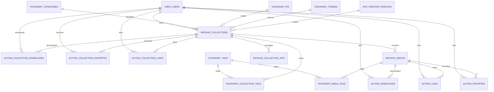
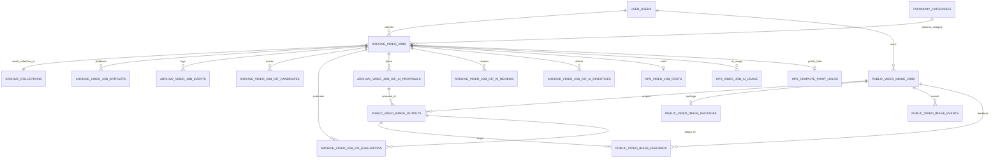
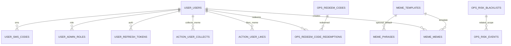

# 02-数据库表关系图

> 数据来源：`internal/models/*.go` + `migrations/*.sql`

## 1. 总览

当前模型总计约 **64 张表**，按 `search_path` 分布在多个 schema：

| Schema | 职责 | 代表表 |
|---|---|---|
| `user` | 用户身份与认证 | `users`, `admin_roles`, `refresh_tokens`, `sms_codes` |
| `archive` | 内容资产与视频任务原始域 | `collections`, `emojis`, `video_jobs`, `video_job_artifacts` |
| `taxonomy` | 分类体系 | `categories`, `tags`, `tag_groups`, `themes`, `ips` |
| `action` | 用户行为 | `downloads`, `favorites`, `likes`, `collection_downloads` |
| `audit` | 审计与统计 | `audit_logs`, `reports`, `home_daily_stats`, `video_ai_prompt_template_audits` |
| `ops` | 运营配置、成本、算力、风控 | `video_quality_settings`, `compute_accounts`, `risk_blacklists` |
| `public` | 前台产品化镜像域 | `video_image_jobs`, `video_image_outputs`, `video_image_feedback` |
| `meme` | Meme 子系统 | `memes`, `templates`, `phrases` |

> 说明：部分关系由业务代码保证，不一定都做了数据库层外键约束。

---

## 2. 内容主域关系图

### 关键表说明

- `user.users`：用户主表
- `archive.collections`：表情包合集主表
- `archive.emojis`：合集内单个表情
- `archive.collection_zips`：合集 ZIP 版本记录
- `taxonomy.categories`：分类树
- `taxonomy.tags` / `taxonomy.tag_groups`：标签系统
- `action.*`：点赞、收藏、下载等行为表

---

## 3. 视频任务与 Public 镜像关系图

### 关键表说明

#### Legacy / Archive 侧

- `archive.video_jobs`：视频任务主表
- `archive.video_job_artifacts`：产物表（frame/clip/poster/package 等）
- `archive.video_job_events`：任务事件流
- `archive.video_job_gif_candidates`：GIF 候选窗口
- `archive.video_job_gif_evaluations`：GIF 评分
- `archive.video_job_gif_ai_proposals`：AI Planner 提名结果
- `archive.video_job_gif_ai_reviews`：AI Judge 复审结果
- `archive.video_job_gif_ai_directives`：AI Director 指令结果

#### Public 侧

- `public.video_image_jobs`：前台产品化任务镜像
- `public.video_image_outputs`：前台产物镜像
- `public.video_image_packages`：ZIP 包镜像
- `public.video_image_events`：公共事件镜像
- `public.video_image_feedback`：按 `output_id` 归属的反馈主链路

#### Ops 侧

- `ops.video_job_costs`：每个 job 的成本快照
- `ops.video_job_ai_usage`：AI token/cost 细项
- `ops.compute_accounts`：算力账户
- `ops.compute_ledgers`：算力台账
- `ops.compute_point_holds`：job 对应积分冻结记录
- `ops.video_job_gif_baselines`：GIF 质量基线
- `ops.video_job_gif_rerank_logs`：反馈 rerank 日志
- `ops.video_job_gif_manual_scores`：人工评审样本

---

## 4. Meme / 风控 / 兑换码关系图

### 关键表说明

- `meme.memes`：用户生成 meme
- `meme.templates`：叠字模板
- `meme.phrases`：AI 匹配用梗文案库
- `action.user_likes` / `action.user_collects`：Meme 的点赞收藏
- `ops.redeem_codes` / `ops.redeem_code_redemptions`：兑换码与兑换记录
- `ops.risk_blacklists` / `ops.risk_events`：风控黑名单与事件

---

## 5. 逻辑关系重点说明

## 5.1 `archive.video_jobs.result_collection_id`

这是视频生产结果与内容库的桥。

- 视频任务最终可能生成一个 `archive.collections`
- 该合集里挂载 `archive.emojis`
- 同时，public 层也会同步一份面向前台的产物视图

所以视频业务同时连接了：

- `archive.video_jobs`
- `archive.collections`
- `archive.emojis`
- `public.video_image_*`

---

## 5.2 Feedback 的新旧双链路

当前代码存在两条反馈路径：

### 新链路（推荐）

- `public.video_image_feedback`
- 以 `output_id` 为中心
- 可追踪到 output / proposal / candidate / evaluation

### 旧链路（兼容）

- `job.metrics.feedback_v1`
- 通过 `ENABLE_LEGACY_FEEDBACK_FALLBACK` 控制兼容写回

这说明你已经在从“按合集/emoji 的弱反馈”，迁移到“按 output 的强反馈链路”。

---

## 5.3 Prompt Template 新增关系

当前工作区新增：

- `ops.video_ai_prompt_templates`
- `audit.video_ai_prompt_template_audits`

用于支撑：

- 按 `format/stage/layer/version` 管理 AI 提示词模板
- 审计谁改了模板、何时激活了哪个版本

这是对 GIF AI pipeline 的重要产品化增强。

---

## 6. 当前数据库设计优点

1. **按 schema 分域明显**：内容、行为、审计、运维、前台镜像分得清楚
2. **视频流水线可观测性强**：events、artifacts、candidate、evaluation、proposal、review 都有落表
3. **成本/积分单独建模**：便于财务与运营
4. **Public 镜像层很有价值**：降低 legacy 结构对产品查询的束缚

---

## 7. 当前数据库设计风险点

1. **大量“逻辑外键”依赖代码保证**
   - 优点是迁移灵活
   - 缺点是数据一致性更多靠应用层守护

2. **视频域模型很多，查询复杂度高**
   - 尤其后台统计、导出、健康分析

3. **同一业务同时存在 archive/public/ops 多视角表**
   - 对新同事理解门槛较高

---

## 8. 推荐的阅读主线

如果要理解数据库，建议按下面顺序：

1. `user.users`
2. `archive.collections` / `archive.emojis`
3. `taxonomy.categories` / `tags`
4. `archive.video_jobs`
5. `archive.video_job_artifacts` / `events`
6. `public.video_image_jobs` / `outputs` / `feedback`
7. `ops.compute_*` / `video_job_costs`
8. `ops.risk_*`
9. `meme.*`

这样能最快建立全局图谱。
